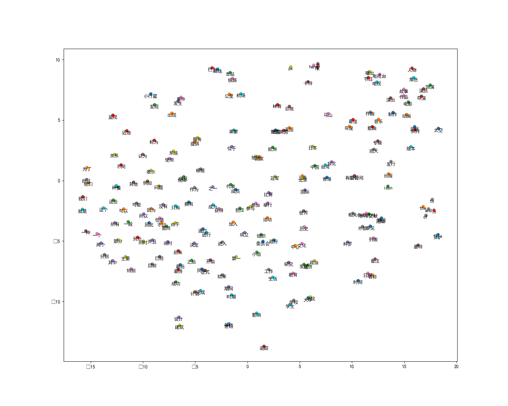

# Word2Vec

训练词向量。


## wiki.zh.word.text

该文件共有 254419 行，其中第一行内容如下所示：
```
欧几里得 西元前 三 世纪 的 希腊 数学家 现在 被 认为 是 几何 之 父 此画 为 拉斐尔 的 作品 雅典 学院 数学 mathematics 是 利用 符号语言 研究 数量 结构 变化 以及 空间 等 概念 的 一门 学科 从 某种 角度看 属于 形式 科学 的 一种 数学 透过 抽象化 和 逻辑推理 的 使用 由 计数 计算 数学家 们 拓展 这些 概念 对 数学 基本概念 的 完善 早 在 古埃及 而 在 古希腊 那里 有 更为 严谨 的 处理 从 那时 开始 数学 的 发展 便 持续 不断 地 小幅 进展 世纪 的 文艺复兴 时期 致使 数学 的 加速 发展 直至 今日 今日 数学 使用 在 不同 的 领域 中 包括 科学 工程 医学 和 经济学 等 有时 亦 会 激起 新 的 数学 发现 并 导致 全新 学科 的 发展 数学家 也 研究 纯数学 就是 数学 本身 的 实质性 内容 而 不以 任何 实际 应用 为 目标 虽然 许多 研究 以 纯数学 开始 但 其 过程 中 也 发现 许多 应用 之 处 词源 西方 语言 中 数学 一 词源 自于 古希腊 语 的 其有 学习 学问 科学 数学 研究 即使 在 其 语源 内 其 形容词 意思 为 和 学习 有关 的 用功 的 亦 会 被 用来 指 数学 的 其 在 英语 中 表面 上 的 复数 形式 及 在 法语 中 的 表面 复数 形式 可溯 至 拉丁文 的 中性 复数 由 西塞罗 译自 希腊文 复数 此一 希腊语 被 亚里士多德 拿来 指 万物 皆 数 的 概念 数学 一词 的 大约 产生 于 宋元 时期 多指 象数 之学 但 有时 也 含有 今天 上 的 数学 意义 例如 秦九韶 的 数学 九章 永乐 大典 数书 九章 也 被 宋代 周密 所著 的 癸 辛杂识 记 为 数学 大略 数学 通轨 明代 柯尚 迁著 数学 钥 清代 杜知 耕著 数学 拾遗 清代 丁取忠 撰 直到 经过 中国 数学 名词 审查 委员会 研究 算学 数学 两词 的 使用 状况 后 确认 以 数学 表示 今天 意义 上 的 数学 含义 历史 奇普 印加帝国 时所 使用 的 计数 工具 数学 有着 久远 的 历史 中国 古代 的 六艺 之一 就 有 数学 一词 在 西方 有 希腊语 词源 mathematik ó s 意思 是 学问 的 基础 源于 m á thema 科学 知识 学问 时间 的 长短 等 抽象 的 数量 关系 比如 时间 单位 有 日 季节 和 年 等 算术 加减乘除 也 自然而然 地 产生 了 历史 上 曾 有 过 许多 不同 的 记数 系统 玛雅 数字 在 最初 有 历史记录 的 时候 为 了解 数字 间 的 关系 为了 测量 土地 以及 为了 预测 天文 事件 而 形成 的 结构 空间 及 时间 方面 的 研究 到 了 世纪 算术 微积分 的 概念 也 在 此时 形成 随着 数学 转向 形式化 从古至今 数学 便 一直 不断 地 延展 且 与 科学 有 丰富 的 相互作用 两者 的 发展 都 受惠 于 彼此 在历史上 有著 许多 数学 发现 并且 直至 今日 都 不断 地有 新 的 发现 据 mikhail sevryuk 于 美国 数学 会 通报 月 的 期刊 中 所说 数学 评论 的 创刊 年份 现已 超过 了 一百九十 万份 而且 每年 还 增加 超过 七万 五千 份 形成 纯数学 与 应用 数学 及 美学 牛顿 微积分 的 发明者 之一 每当 有 涉及 数量 结构 空间 及 变化 等 方面 的 困难 问题 时 而 这 往往 也 拓展 了 数学 的 研究 范畴 一 开始 数学 的 运用 可见 于 贸易 土地 测量 及 之后 的 天文学 今日 且 数学 本身 亦 给出 了 许多 的 问题 牛顿 和 莱布尼兹 是 微积分 的 发明者 费曼 发明 了 费曼 路径 积分 这是 推理 及 物理 洞察 二者 的 产物 而 今日 的 弦 理论 亦 引申 出新 的 数学 一些 数学 只 和 生成 它 的 领域 有关 且 用来 解答 此 领域 的 更 多 问题 且 可以 成为 一般 的 数学 概念 即使 是 最纯 的 数学 通常 亦 有 实际 的 用途 此一 非比寻常 的 事实 年 诺贝尔 物理 奖得主 维格纳 称为 如同 大多数 的 研究 领域 主要 的 分歧 为 纯数学 和 应用 数学 在 应用 数学 内 又 被 分成 两大 领域 并且 变成 了 它们 自身 的 学科 统计学 和 电脑 科学 许多 数学家 谈论 数学 的 优美 其内 在 的 美学 及美 简单 一般化 即 为 美的 一种 另外 亦 包括 巧妙 的 证明 又 或者 是 加快 计算 的 数值 方法 如 快速 傅立叶 变换 高 德菲 哈罗德 哈代 在 一个 数学家 的 自白 符号 语言 与 精确性 在 现代 的 符号 中 此一 图像 即 产生 自 x cos arccos sin 〡 arcsin cos 〡 世纪 后 才 被 发明 出来 的 在此之前 数学 以 文字 的 形式 书写 出来 这种 形式 会 限制 了 数学 的 发展 但 初学者 却常 对此 感到 怯步 它 被 极度 的 压缩 少量 的 符号 包含 著 大量 的 讯息 如同 音乐 符号 一般 现今 的 数学 符号 有 明确 的 语法 并且 有效 地 对 讯息 作 编码 这是 其他 书写 方式 难以 做到 的 符号化 和 形式化 使得 数学 迅速 发展 数学 语言 亦 对 初学者 而言 感到 困难 亦 困恼 著 初学者 的 开放 等 字 在 数学 里 有 著 特别 的 意思 数学 术语 亦 包括 如 同 胚 可积性 等 专有名词 数学 需要 比 日常用语 更 多 的 精确性 严谨 但 在 现实 应用 中 定理 希腊人 期许 著 仔细 的 论证 但 在 牛顿 的 时代 所 使用 的 方法 则 较 不 严谨 牛顿 为了 解决问题 所 做 的 定义 今日 当 大量 的 计算 难以 被 验证 时 其 证明 亦 很难说 是 足够 地 严谨 公理 在 传统 的 思想 中是 不证 自明 的 真理 但 这种 想法 是 有 问题 的 在 形式 上 公理 只是 一串 符号 但 依据 哥德尔 不 完备 定理 尽管如此 在 此 意义 下 数学 作为 科学 卡尔 弗里德里希 高斯 卡尔 弗里德里希 高斯 称 数学 为 科学 的 皇后 在 拉丁 原文 以及 其 德语 对应 于 科学 的 单字 的 意思 皆 为 知识 领域 而 实际上 科学 若 认为 科学 是 只 指 物理 的 世界 时 则 数学 或 至少 是 纯数学 不会 是 一门 科学 爱因斯坦 曾 如此 描述 数学 定律 越 和 现实 有关 它们 越 不 确定 若 它们 越是 确定 的话 它们 和 现实 越 不会 有关 且 因此 不是 卡尔 波普尔 所 定义 的 科学 但 在 年代 时 且 波普尔 推断 大部份 的 数学 定律 如 物理 及 生物学 一样 是 假设 演绎 的 比 它 现在 看起来 更 接近 然而 其他 的 思想家 如较 著名 的 拉 卡托斯 另 一 观点 则 为 某些 科学 领域 如 理论物理 是 其 公理 为 尝试 著 符合 现实 的 数学 而 事实上 理论 物理学家 齐曼 john ziman 即 认为 科学 是 一种 公众 知识 因此 亦 包含 著 数学 在 任何 的 情况 下 减轻 了 数学 不 使用 科学 方法 的 缺点 在 史蒂芬 沃尔夫 勒姆 年 的 著作 一种 新 科学 中 他 提出 数学家 对此 的 态度 并 不 一致 且 因此 基本上 是 个 哲学家 是 低估 了 其 美学 方面 的 重要性 被 创造 如 艺术 或是 被 发现 如 科学 的 争议 大学 院系 划分 中 常见 科学 和 数学系 实际上 但 在 细节 上 却 会 分开 数学 的 各 领域 有如 反映 在 中国 算盘 上 的 一般 如上所述 了解 数字 间 的 关系 测量 土地 及 预测 天文 事件 这 四种 需要 大致 地 与 数量 结构 空间 及 变化 即 算术 代数 几何 及 分析 等 数学 上 广泛 的 子 领域 相关 连著 除了 上述 主要 的 关注 之外 至 逻辑 至 集合论 基础 至 不同 科学 的 经验 上 的 数学 应用 数学 及 较 近代 的 至 不确定性 的 严格 研究 基础 与 哲学 为了 阐明 数学 基础 并 研究 此一 架构 的 结果 就 其 本身 而言 现代 逻辑 被 分成 递归论 模型 论 和 证明 论 千禧年 大奖 难题 中 的 p style border px solid ddd text align center margin auto cellspacing px px 数学 逻辑 集合论 范畴 论 纯粹 数学 数量 数量 的 研究 起于 数 孪生 质数 猜想 及 哥德巴赫猜想 当数系 更进一步 发展 时 整数 被 视为 有理数 的 子集 而 有理数 则 包含 于 实数 中 连续 的 量 即 是 以 实数 来 表示 的 实数 则 可以 被 进一步 广义 化成 复数 从 自然数 亦 可以 推广 到 超限 数 它 形式化 了 计数 至 无限 的 这 一 概念 另 一个 研究 的 领域 为 大小 阿列 夫数 style border px solid ddd text align center margin auto cellspacing 自然数 整数 有理数 实数 复数 结构 这些 物件 的 结构 性质 被 探讨 于群 zh cn zh tw 等 抽象 系统 中 该些 物件 事实上 也 就是 这样 的 系统 此 为 代数 的 领域 在 此 有 一个 很 重要 的 概念 即 广义 化至 向量 空间 的 向量 它于 线性代数 中 被 研究 数量 结构 及 空间 即 变化 纯粹 数学 是 研究 抽象 结构 的 理论 结构 布尔 巴基 学派 认为 有 三种 基本 的 抽象 结构 代数 结构 序 结构 偏序 全序 拓扑 结构 邻域 极限 连通性 维数 style border px solid ddd text align center margin auto cellspacing px px px px 数论 群论 图论 序 理论 空间 空间 的 研究 源自 于 几何 尤其 是 欧几里得 几何 三角学 则 结合 了 空间 及数 且 包含 有 著名 的 勾股定理 非 欧几里得 几何 及 拓扑学 数 和 空间 在 解析几何 结合 了 数 和 空间 的 概念 亦 有 著 拓扑 群 的 研究 结合 了 结构 与 空间 李群 被 用来 研究 空间 结构 及 变化 在 其 许多 分支 中 并 包含 有 存在 已久 的 庞加莱 猜想 以及 有 争议 的 四色 定理 庞加莱 猜想 已 在 年 确认 由 俄罗斯 数学家 格里 戈里 佩雷尔曼 证明 而 四色 定理 已 在 年 由凯 尼斯 阿佩尔 和 沃夫冈 哈肯 用 电脑 证明 而 从来 没有 由 人力 来 验证 过 style border px solid ddd text align center margin auto cellspacing px px px px px px 几何 三角学 微分 几何 拓扑学 zh cn 分形 zh tw 碎形 测度论 变化 而 微积分 更为 研究 变化 的 有利 工具 函数 诞生 于 此 做 为 描述 一 变化 的 量 的 核心 概念 而复 分析 则 为 复数 的 等价 领域 黎曼 猜想 数学 最 基本 的 未决 问题 之一 便是 以 复分析 来 描述 的 泛函 分析 注重 在 函数 的 一般 为 无限 维 空间 上 而 这 在 微分方程 中 被 研究 px px px px px px 微积分 向量分析 微分方程 动力系统 混沌 理论 复分析 离散数学 这 包含 有 可 计算 理论 计算 复杂性 理论 及 资讯 理论 这 包含 现知 最 有力 的 模型 图灵机 尽管 电脑 硬体 的 快速 进步 最后 且 因此 有 压缩 及 熵 等 概念 做 为 一 相对 较 新 的 领域 离散数学 有 许多 基本 的 未解 问题 其中 最 有名 的 为 p np 问题 千禧年 大奖 难题 之一 一般 相信 此 问题 的 解答 是 否定 的 style border px solid ddd text align center margin auto cellspacing px px px 组合 数学 计算 理论 密码学 图论 应用 数学 工商业 及其 他 领域 上 之 现实 问题 应用 数学 中 的 一 重要 领域 为 统计学 分析 与 预测 大部份 的 实验 而 比较 觉得 是 合作 团体 的 一份 子 数值 分析 研究 有 什么 计算方法 file gravitation space source png 数学 物理 file png 数学 流体力学 file composite trapezoidal rule illustration small png 数值 分析 file maximum boxed png 最佳化 file two red dice svg 概率论 file oldfaithful png 统计学 file market data index nya on utc png 计量 金融 file arbitrary gametree solved png zh tw 赛局 理论 zh cn 博弈论 file front pareto svg 数理经济学 file signal transduction pathways zh cn svg 生物 数学 file linear programming example graph zh png 作业 研究 file simple feedback control loop svg 控制论 数学 奖项 菲尔 兹 奖牌 正面 数学 奖 通常 和 其他 科学 的 奖项 分开 数学 上 最 有名 的 奖为 菲尔 兹奖 创立 于 每 四年 颁奖 一次 它 通常 被 认为 是 数学 的 诺贝尔奖 创立 于 两者 都 颁奖 于 特定 的 工作 主题 著名 的 个 问题 称为 希尔伯特 的 个 问题 年 由 德国 数学家 大卫 希尔伯特 所 提出 另 一新 的 七个 重要 问题 称为 千禧年 大奖 难题 发表 于 而 当中 只有 一个 问题 黎曼 猜想 和 希尔伯特 的 问题 重复 菲尔 兹奖 每 四年 颁奖 一次 颁 给 有 卓越贡献 的 年轻 数学家 每次 最多四人 得奖 得奖者 须 在 该 年 元旦 前 未满 四十岁 是 年轻 数学家 可以 获得 的 最大 奖项 它 是 据 加拿大 数学家 约翰 查尔斯 菲尔 兹 的 要求 设立 的 菲尔 兹 奖 被 视为 数学 界 的 诺贝尔奖 沃尔夫 奖 由 沃尔夫 基金会 颁发 该 基金会 于 年 在 以色列 创立 年 开始 颁奖 创始人 里卡多 沃尔夫 是 外交家 实业家 和 慈善家 阿贝尔 奖 每年 颁发 一次 为了 纪念 年 挪威 著名 数学家 尼尔斯 亨利 克 阿贝尔 二百 周年 诞辰 挪威政府 宣布 将 开始 颁发 此种 奖金 奖金 的 数额 大致 同 诺贝尔奖 相近 年 挪威政府 拨款 亿 挪威克朗 作为 启动资金 扩大 数学 的 影响 参见 数学 哲学 数学 游戏 数学家 列表 教育 算经十书 数学 竞赛 注记 参考书目 benson donald the moment of proof mathematical epiphanies oxford university press usa new ed edition december isbn boyer carl history of mathematics wiley edition march isbn concise history of mathematics from the concept of number to contemporary mathematics courant and robbins what is mathematics an elementary approach to ideas and methods oxford university press usa edition july isbn davis philip and hersh reuben the mathematical experience mariner books reprint edition january isbn gentle introduction to the world of mathematics eves howard an introduction to the history of mathematics sixth edition saunders isbn gullberg jan mathematics from the birth of numbers norton company st edition october isbn an encyclopedic overview of mathematics presented in clear simple language hazewinkel michiel ed 数学 百科全书 kluwer academic publishers translated and expanded version of soviet mathematics encyclopedia in ten expensive volumes the most complete and authoritative work available also in paperback and on cd rom and online jourdain philip the nature of mathematics in the world of mathematics james newman editor dover isbn kline morris mathematical thought from ancient to modern times oxford university press usa paperback edition march isbn 牛津 英语词典 second edition ed john simpson and edmund weiner clarendon press isbn the oxford dictionary of english etymology reprint isbn pappas theoni the joy of mathematics wide world publishing revised edition june isbn peterson ivars mathematical tourist new and updated snapshots of modern mathematics owl books isbn 参考 网址 rusin dave the mathematical atlas 英文版 现代 数学 漫游 weisstein eric world of mathematics 一个 在线 的 数学 百科全书 planet math 另 一个 在线 的 数学 百科全书 使用 gfdl 允许 和 维基百科 交换 条目 mathforge 一个 包含 数学 物理 epistemath 数学知识 香港科技大学 数学网 一个 以 数学史 为主 的 网站 怎样 研习 纯数学 或 统计学 本科 与 基础 研究 课程 参考书目 数学 文化 主要 面向 大学生 大学老师 和 研究生 以及 中学老师 和 学生 数学 学习 资源 互联网 上 数学 学习 资源 和 教学 视频 英汉 对照 数学 用语 archive 英汉 对照 数学 用语 albany bureau of bilingual education see profile at archive
```

## 使用 gensim 训练词向量

- main_1.py
- 训练耗时 1218 s
- 保存模型产生 3 个文件：gensim_128.wv.vectors.npy、gensim_128.trainables.syn1neg.npy、gensim_128

## 加载并使用模型

使用 main_2.py 加载并使用模型，得到的结果如下：
```
====================================================================================================
model.wv.most_similar('数学')：
1 算术 0.8068950772285461
2 微积分 0.7931571006774902
3 概率论 0.7528527975082397
4 高等数学 0.7346343994140625
5 数论 0.726527214050293
6 数学分析 0.7177163362503052
7 几何学 0.7173334360122681
8 逻辑学 0.7138167023658752
9 物理 0.7129901647567749
10 统计学 0.7031056880950928
====================================================================================================
model.wv.most_similar(positive=['中国', '纽约'], negative=['北京']):
0 美国 0.7525889873504639
1 旧金山 0.5923081636428833
2 英国 0.591943621635437
3 华尔街 0.5713268518447876
4 洛杉矶 0.5644786357879639
5 美洲 0.5625008344650269
6 纽约时报 0.5617920160293579
7 芝加哥 0.5610405802726746
8 加拿大 0.5568618774414062
9 北美 0.5555638074874878
====================================================================================================
model.wv.doesnt_match(['早餐', '午餐', '晚餐', '手机']):
手机
====================================================================================================
model.wv.similarity('男人', '女人'):
0.90647924
```

## 使用 tensorflow 训练词向量

- skip_gram_tf.ipynb
- 保存模型产生 3 个文件 tf_128.meta、tf_128.index、tf_128.data-00000-of-00001
- 另外将词向量以及词和 id 相互映射用到的词典保存到了 tf_128.pkl 中

## 使用 tensorflow 加载并使用模型

使用 test_tf_128.py 加载并使用模型得到以下结果：
```
<tensorflow.python.framework.ops.Graph object at 0x7fd5ee29eef0>
Nearest to 数学: 物理 应用 理论 科学 化学 天文学 语言学 物理学 哲学 领域
0.5253779
['物理', 0.6886327]
['应用', 0.6369873]
['理论', 0.6178505]
['科学', 0.590371]
['化学', 0.5878555]
['天文学', 0.5571585]
['语言学', 0.54534245]
['物理学', 0.54194874]
['哲学', 0.5311295]
['领域', 0.522904]
早餐
```

## 降维并可视化（test_tf_128.py）



## 其他相关的知识点

- tf.train.import_meta_graph
- tf.get_default_graph
- get_tensor_by_name
- t-SNE 降维并可视化
- argsort()

## 参考

- 《深度有趣》 —— 张宏伦
- [word2vec原理(一) CBOW与Skip-Gram模型基础](https://www.cnblogs.com/pinard/p/7160330.html)
- [word2vec原理(二) 基于Hierarchical Softmax的模型](https://www.cnblogs.com/pinard/p/7243513.html)
- [word2vec原理(三) 基于Negative Sampling的模型](https://www.cnblogs.com/pinard/p/7249903.html)
